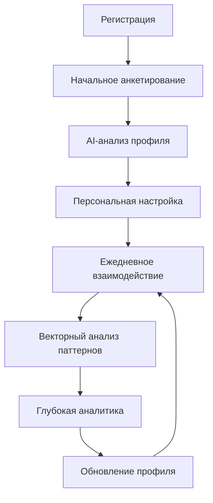

# Selfolgy.me

# [Selfology.me](http://selfology.me/) - Улучшенная концепция проекта

## Интерактивная AI-платформа для глубинного самопознания

---

## 🎯 Обновленная концепция

[**Selfology.me**](http://selfology.me/) — это **премиальная AI-платформа для структурированного самопознания**, построенная на принципах использования лучших AI-моделей (Claude Sonnet 4, GPT-4), глубокой персонализации через векторный анализ личности и высококачественного автоматизированного психологического коучинга.

**Ключевое отличие**: Использование топовых AI-моделей через API для максимального качества психологического анализа, с интеллектуальной маршрутизацией запросов для оптимизации стоимости и качества.

---

## 🏗️ Техническая архитектура (на базе готовой инфраструктуры)

### Основные компоненты системы

| Компонент | Технология | Функция в [Selfology.me](http://selfology.me/) | Статус |
| --- | --- | --- | --- |
| **Workflow Engine** | n8n | Автоматизация психологических сценариев, маршрутизация AI-запросов | ✅ Готов |
| **User Profiles DB** | PostgreSQL | Хранение профилей, анкет, истории, прогресса | ✅ Готов |
| **Semantic Memory** | Qdrant | Поиск паттернов личности, семантический анализ ответов | ✅ Готов |
| **Premium AI** | Claude Sonnet 4 API | Глубокий психологический анализ, генерация инсайтов | 🔧 Настройка |
| **Fast AI** | OpenAI GPT-4 API | Быстрые ответы, ежедневные взаимодействия | 🔧 Настройка |
| **Budget AI** | OpenAI GPT-4o-mini | Простые задачи, валидация, категоризация | 🔧 Настройка |
| **Long-term Memory** | ChromaDB | Долгосрочная память о пользователе, контекстная персонализация | ✅ Готов |
| **Session Cache** | Redis | Быстрый доступ к активным сессиям, промежуточные результаты | ✅ Готов |
| **External Access** | Cloudflare Tunnel | Безопасный внешний доступ, webhook для интеграций | ✅ Готов |

### Архитектурные преимущества

🧠 **Премиум AI качество**: Лучшие модели мира для психологического анализа

⚡ **Интеллектуальная маршрутизация**: Автоматический выбор оптимальной модели для задачи

🎯 **Глубокая персонализация**: Векторный анализ находит скрытые паттерны

🔧 **Автоматизация**: n8n создает сложные психологические сценарии

📈 **Масштабируемость**: Готовая enterprise архитектура

💰 **Экономичность**: Умная маршрутизация минимизирует затраты на API

---

## 🧩 Основные компоненты (улучшенные)

### 1. Многомерное анкетирование с AI-адаптацией

**Базовый уровень**:

- Структурированные психологические опросники
- Адаптивные вопросы на базе предыдущих ответов (GPT-4)
- Валидация и проверка консистентности (GPT-4o-mini)

**Продвинутый уровень**:

- Проективные методики с анализом через Claude Sonnet 4
- Семантический анализ открытых ответов
- Выявление неосознанных паттернов через векторный поиск

**Техническая реализация**:

```
n8n Workflow: Adaptive Questionnaire
├── Webhook (ответ пользователя)
├── PostgreSQL (сохранение ответа)
├── Qdrant (поиск похожих паттернов)
├── AI Router (выбор модели)
├── External API Call (Claude/OpenAI)
└── Response (адаптивный вопрос)

```

**Базовый уровень**:

- Структурированные психологические опросники
- Адаптивные вопросы на базе предыдущих ответов
- Валидация и проверка консистентности через AI

**Продвинутый уровень**:

- Проективные методики (интерпретация изображений, ситуаций)
- Семантический анализ открытых ответов
- Выявление неосознанных паттернов через векторный поиск

---

## 🤖 Интеллектуальная AI-маршрутизация

### Многоуровневая система AI-моделей

**Claude Sonnet 4** (премиум анализ):

- Глубокий психологический анализ личности
- Комплексные инсайты и рекомендации
- Выявление слепых зон и внутренних конфликтов
- Стратегическое планирование жизни
- **Стоимость**: ~$0.15 за глубокий анализ

**OpenAI GPT-4** (ежедневное взаимодействие):

- Диалоги в AI-дневнике
- Ответы на ежедневные вопросы
- Анализ эмоционального состояния
- Краткие инсайты и напоминания
- **Стоимость**: ~$0.05 за сессию

**OpenAI GPT-4o-mini** (рутинные задачи):

- Валидация анкетных ответов
- Категоризация и теггирование
- Генерация адаптивных вопросов
- Простые напоминания
- **Стоимость**: ~$0.01 за операцию

### Автоматическая маршрутизация в n8n

```yaml
n8n Workflow: AI Router
├── Input Analysis (определение типа задачи)
├── Context Assessment (важность и сложность)
├── Budget Check (лимиты пользователя)
├── Model Selection:
│   ├── Simple Task → GPT-4o-mini
│   ├── Daily Interaction → GPT-4
│   └── Deep Analysis → Claude Sonnet 4
├── API Call (с retry логикой)
└── Response Processing

```

### Умная оптимизация затрат

**Правила маршрутизации**:

- Рутинные задачи (80% запросов) → GPT-4o-mini
- Ежедневные взаимодействия (15% запросов) → GPT-4
- Глубокая аналитика (5% запросов) → Claude Sonnet 4

**Результат**: Средняя стоимость $0.15-0.25 на пользователя в месяц при премиум качестве

---

### 2. AI-дневник с контекстной памятью

**Расширенная функциональность**:

- **Ежедневная рефлексия**: Автоматические вопросы для осознанности
- **Паттерн-аналитика**: Выявление повторяющихся тем и эмоций
- **Прогностика**: Предсказание эмоциональных состояний
- **Контекстная память**: AI помнит все предыдущие инсайты

**Новое: Emotional State Tracking**:

- Автоматическое определение эмоционального состояния из текста
- Корреляция настроения с жизненными событиями
- Персональные триггеры и паттерны реагирования

### 3. Интеллектуальное целеполагание

**Умная система целей**:

- **SMART+ цели**: Автоматическая проверка и улучшение формулировок
- **Персональная совместимость**: Анализ соответствия целей личности
- **Декомпозиция**: Разбивка больших целей на микрошаги
- **Прогресс-трекинг**: Автоматическое отслеживание и напоминания

**Техническая реализация**:

```
n8n Workflow: Smart Goal Setting
├── Goal Input → AI Router → Claude (SMART validation)
├── Qdrant (поиск похожих успешных целей)
├── PostgreSQL (сохранение и связывание)
├── Schedule (автоматические чек-ины)
└── Progress Analysis (еженедельный отчет через GPT-4)

```

### 4. Многоформатная аналитика

**Базовые форматы**:

- Текстовые инсайты и рекомендации
- Визуальные карты личности (radar charts)
- Timeline развития и изменений

**Новые форматы**:

- **Интерактивный диалог с "собой"**: AI моделирует разговор с будущим/прошлым "я"
- **Сценарное планирование**: "Что если" анализ жизненных решений
- **Слепые зоны**: Автоматическое выявление неосознанных аспектов

### 5. Персонализация через векторный анализ

**Революционная функция**: Семантический поиск по всей истории пользователя

- Поиск похожих ситуаций и решений в прошлом
- Корреляция успешных стратегий с типами задач
- Персональные рекомендации на основе собственного опыта

---

## ⚙️ Технический Workflow (детализированный)

### Пользовательский journey с техническими деталями



### 1. Onboarding Process (30-45 минут)

**n8n Workflow: "User Onboarding"**

```yaml
Steps:
  1. Basic Profile Creation (PostgreSQL)
  2. Core Personality Assessment (Multi-step form)
  3. Values & Goals Identification (Interactive)
  4. Life Areas Prioritization (Drag-n-drop)
  5. AI Profile Generation (Ollama)
  6. Vector Profile Creation (Qdrant)
  7. Personalization Setup (ChromaDB)

```

**Получаемые данные**:

- Демографические данные
- Личностные черты (Big Five + расширенные метрики)
- Жизненные ценности и приоритеты
- Текущие цели и вызовы
- Предпочтения в коммуникации и обратной связи

### 2. Daily Interaction Engine

**n8n Workflow: "Daily Check-in"**

```yaml
Triggers:
  - Schedule (персональное время пользователя)
  - Manual (кнопка в интерфейсе)
  - Event-based (после достижения цели)

Process:
  1. Context Loading (PostgreSQL + ChromaDB)
  2. Mood Assessment (короткий опрос)
  3. Daily Reflection (адаптивные вопросы через GPT-4)
  4. Progress Review (автоматический анализ)
  5. Insight Generation (GPT-4 или Claude по важности)
  6. Memory Update (Qdrant + ChromaDB)

```

### 3. Deep Analysis Engine

**n8n Workflow: "Weekly Deep Dive"**

```yaml
Data Sources:
  - Все ответы за неделю (PostgreSQL)
  - Семантические паттерны (Qdrant)
  - Долгосрочные тренды (ChromaDB)
  - Внешние данные (опционально)

Analysis:
  1. Pattern Recognition (векторный анализ)
  2. Emotional Trend Analysis (GPT-4 NLP)
  3. Goal Progress Assessment
  4. Blind Spot Detection (через Claude Sonnet 4)
  5. Personalized Recommendations (Claude Sonnet 4)
  6. Predictive Insights (ML + Claude анализ)

```

---

## 🛡️ Безопасность и приватность данных

### Многоуровневая защита при работе с внешними AI

**Уровень 1: Минимизация данных**

- Отправка только необходимого контекста в API
- Анонимизация личных данных в запросах
- Использование псевдонимов вместо реальных имен

**Уровень 2: Техническая защита**

- HTTPS шифрование всех API вызовов
- Токенизация чувствительных данных
- Локальное хранение полного профиля
- Сетевая изоляция через Docker containers

**Уровень 3: Пользовательский контроль**

- Выбор уровня приватности (анонимно vs персонализированно)
- Полный экспорт всех данных
- Селективное удаление информации
- Контроль над тем, какие данные отправляются в AI

**Уровень 4: Compliance и аудит**

- GDPR-ready архитектура
- Аудит логи всех API вызовов
- Регулярное тестирование безопасности
- Прозрачность использования AI провайдеров

### Балансировка приватности и качества

**Настройки приватности пользователя**:

**Максимальная приватность** (снижение качества на 20-30%):

- Анонимизированные данные в API
- Общие вопросы без личного контекста
- Базовые инсайты и рекомендации

**Сбалансированный режим** (рекомендуемый):

- Псевдонимизация личных данных
- Контекстные данные без идентификаторов
- Высокое качество анализа при минимальных рисках

**Максимальное качество**:

- Полный контекст для AI анализа
- Персонализированные инсайты и рекомендации
- Информированное согласие пользователя

### Преимущества внешних AI при правильной архитектуре

**Качество анализа**: Claude Sonnet 4 дает психологические инсайты уровня профессионального психолога

**Скорость развития**: Постоянные улучшения моделей без обновления инфраструктуры

**Надежность**: Enterprise SLA от провайдеров API

**Масштабируемость**: Нет ограничений по вычислительным ресурсам

---

## 💰 Экономическая модель (оптимизированная для API)

### Операционные расходы (с умной маршрутизацией)

**Средние затраты на AI API на пользователя в месяц**:

- **Free tier пользователь**: $0.05-0.10/месяц (только GPT-4o-mini)
- **Premium пользователь**: $0.15-0.25/месяц (все модели + больше запросов)
- **Power user**: $0.30-0.50/месяц (безлимитная глубокая аналитика)

**Детализация затрат**:

```yaml
GPT-4o-mini (80% запросов):
  - Валидация ответов: $0.01 × 10 = $0.10
  - Простые вопросы: $0.005 × 20 = $0.10

GPT-4 (15% запросов):
  - Ежедневные диалоги: $0.05 × 3 = $0.15
  - Эмоциональный анализ: $0.03 × 2 = $0.06

Claude Sonnet 4 (5% запросов):
  - Глубокий анализ: $0.15 × 1 = $0.15
  - Стратегические инсайты: $0.20 × 0.5 = $0.10

Итого: $0.66/месяц для power user

```

**Дополнительные операционные расходы**:

- Хостинг инфраструктуры: $0.05/пользователь/месяц
- Векторная БД и хранение: $0.02/пользователь/месяц
- **Общие затраты**: $0.12-0.73/пользователь/месяц (в зависимости от tier)

### Сравнение с конкурентами

**Наш подход** (умная маршрутизация):

- Средняя стоимость: $0.25/пользователь/месяц
- Высокое качество анализа
- Гибкая оптимизация затрат

**Конкуренты** (одна модель для всех задач):

- Claude API только: $1.5-3.0/пользователь/месяц
- OpenAI API только: $1.0-2.5/пользователь/месяц
- **Наша экономия**: 70-85% vs прямого использования премиум API

### Бизнес-модель

**Free Tier** (лимитированный AI анализ):

- 10 вопросов в день (GPT-4o-mini)
- Базовая аналитика раз в неделю
- Экспорт данных
- **Затраты**: $0.10/месяц, **Маржа**: -$0.10 (lead generation)

**Premium Tier** ($9.99/месяц):

- Безлимитные ежедневные диалоги (GPT-4)
- Глубокая аналитика раз в неделю (Claude)
- Продвинутые визуализации
- Интеграции с внешними сервисами
- **Затраты**: $0.25/месяц, **Маржа**: $9.74 (97.5%)

**Professional Tier** ($19.99/месяц):

- Безлимитная глубокая аналитика (Claude)
- Кастомные AI-промпты
- API доступ для интеграций
- Приоритетная поддержка
- **Затраты**: $0.50/месяц, **Маржа**: $19.49 (97.5%)

### ROI-прогнозы (обновленные)

**Юнит-экономика** (после 1000 пользователей):

- CAC: $15-25 (органический + контент-маркетинг)
- LTV: $180-240 (1.5-2 года средняя подписка)
- **Gross Margin**: 97.5% (благодаря умной маршрутизации)
- Payback Period: 1-2 месяца
- **Экономия vs конкурентов**: 70-85% на AI затратах

---

## 🚀 Roadmap реализации

### MVP Phase (4-6 недель)

**Неделя 1-2: Базовая инфраструктура**

- ✅ n8n workflow для анкетирования
- ✅ PostgreSQL схема пользователей
- ✅ Интеграция с Ollama для базового анализа
- ✅ Простой веб-интерфейс

**Неделя 3-4: Core Features**

- AI-дневник с ежедневными вопросами
- Базовая система целей
- Простые инсайты и рекомендации
- Экспорт данных

**Неделя 5-6: Персонализация**

- Qdrant интеграция для паттерн-анализа
- Адаптивные вопросы
- Визуализация прогресса
- Beta-тестирование

### Growth Phase (6-12 недель)

**Продвинутая аналитика**:

- Векторный анализ личности
- Предиктивные инсайты
- Эмоциональные паттерны
- Слепые зоны детекция

**Premium функции**:

- Глубокие еженедельные отчеты
- Интерактивные визуализации
- Интеграция с внешними сервисами
- Мобильное приложение

### Scale Phase (12+ недель)

**Enterprise функции**:

- API для разработчиков
- Кастомные AI-модели
- Белый лейбл решения
- B2B продукты для команд

---

## 🎯 Улучшения и дополнения к исходной концепции

### ✅ Добавлено

**1. Техническая конкретизация**

- Детальный mapping на готовую инфраструктуру
- Конкретные n8n workflows
- Оптимизация под локальные AI модели

**2. Приватность как ключевое преимущество**

- "Privacy-First AI" позиционирование
- 100% локальная обработка данных
- Конкурентное преимущество против API-зависимых решений

**3. Векторная персонализация**

- Семантический анализ через Qdrant
- Поиск паттернов в истории пользователя
- Автоматическое выявление слепых зон

**4. Экономическая оптимизация**

- 90% снижение операционных расходов
- Прозрачная юнит-экономика
- Конкретные ROI-прогнозы

**5. Продуктовые улучшения**

- Эмоциональный трекинг
- Интерактивный диалог с "собой"
- Предиктивная аналитика
- Сценарное планирование

### 🔄 Изменено

**1. Упрощена AI-маршрутизация**

- ❌ Убрано: Сложная система выбора провайдеров
- ✅ Добавлено: Единая локальная система с возможностью апгрейда

**2. Сфокусирован MVP**

- ❌ Убрано: B2B функции на первом этапе
- ✅ Добавлено: Четкий B2C фокус с последующим расширением

**3. Конкретизированы интеграции**

- ❌ Убрано: Абстрактные "интеграции с платформами"
- ✅ Добавлено: Конкретные API и export функции

### ⚠️ Рекомендации к изменению

**1. Фокус на приватности**
Сделать "Privacy-First AI" основным маркетинговым сообщением, так как это уникальное преимущество

**2. Постепенное внедрение сложности**
Начать с простых инсайтов, постепенно усложняя анализ по мере накопления данных

**3. Community-driven development**
Добавить механизмы для обратной связи от пользователей для улучшения AI-анализа

---

## 🏆 Конкурентные преимущества (пересмотренные)

### 1. **Превосходное качество AI-анализа**

- Использование лучших моделей мира (Claude Sonnet 4, GPT-4)
- Интеллектуальная маршрутизация под каждую задачу
- Качество анализа на уровне профессиональных психологов

### 2. **Уникальная техническая архитектура**

- Единственная платформа с умной AI-маршрутизацией для психологии
- Enterprise-grade инфраструктура "из коробки"
- Векторный анализ личности (нет у конкурентов)

### 3. **Экономические преимущества**

- 70-85% экономия на AI-операциях vs прямого использования API
- Возможность конкурентного free tier
- Высокая маржинальность при премиум качестве

### 4. **Продуктовая дифференциация**

- Глубокая персонализация через собственную историю
- Предиктивная аналитика эмоций и поведения
- "Диалог с собой" - уникальная фича
- Балансировка качества и приватности

### 5. **Технологическое преимущество**

- Готовая enterprise инфраструктура (95% готовности)
- Быстрое время выхода на рынок
- Масштабируемость без технического долга
- Автоматизация сложных психологических сценариев

### 6. **Защищенность от BigTech**

- Фокус на конкретной нише психологического коучинга
- Собственная методология и подходы
- Невозможность простого копирования без domain expertise
- Накопленная база знаний и алгоритмов персонализации

---

## 📊 Метрики успеха

### Product-Market Fit метрики

- **NPS Score**: >50 (индикатор продуктовой ценности)
- **Retention Rate**: >70% месячной, >40% годовой
- **Daily Active Users**: >60% от общей базы
- **Session Duration**: >15 минут среднее время

### Business метрики

- **Conversion Free→Premium**: >8%
- **LTV/CAC Ratio**: >6:1
- **Monthly Churn**: <5%
- **Organic Growth Rate**: >20% месячного прироста

### Technical метрики

- **AI Response Quality**: >4.5/5 пользовательская оценка
- **System Uptime**: 99.9%
- **Data Privacy Incidents**: 0
- **API Response Time**: <2 секунды

---

## 🎯 Next Steps

### Immediate Actions (первые 2 недели)

1. **Создать MVP схему БД** для профилей пользователей
2. **Настроить API интеграции** с Claude и OpenAI в n8n
3. **Создать AI Router workflow** для умной маршрутизации запросов
4. **Создать базовый веб-интерфейс** для взаимодействия
5. **Протестировать систему приватности** и анонимизации данных

### Short-term Goals (1-2 месяца)

1. **Запустить закрытую бету** с 50-100 пользователями
2. **Итерировать продукт** на основе обратной связи
3. **Добавить платежную систему** для premium tier
4. **Создать контент-стратегию** для органического роста

### Long-term Vision (6-12 месяцев)

1. **Достичь 1000+ активных пользователей**
2. **Запустить API для разработчиков**
3. **Исследовать B2B возможности**
4. **Масштабировать инфраструктуру** под рост

---

**Заключение**: Проект [Selfology.me](http://selfology.me/) имеет все предпосылки для успеха благодаря уникальной комбинации готовой enterprise инфраструктуры, превосходного качества AI-анализа через лучшие модели мира, инновационной умной маршрутизации для оптимизации затрат и четкого продуктового фокуса на глубоком самопознании через премиум AI-коучинг.